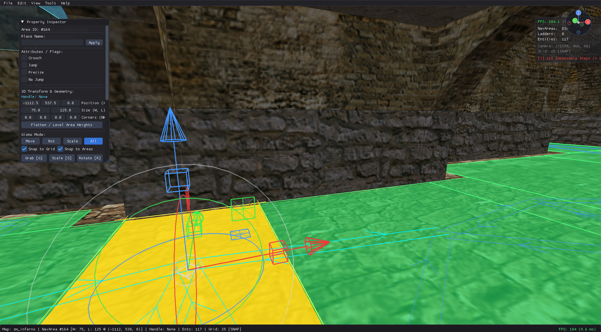
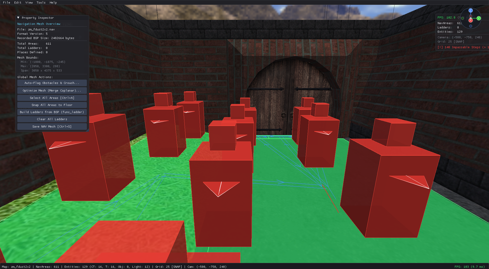
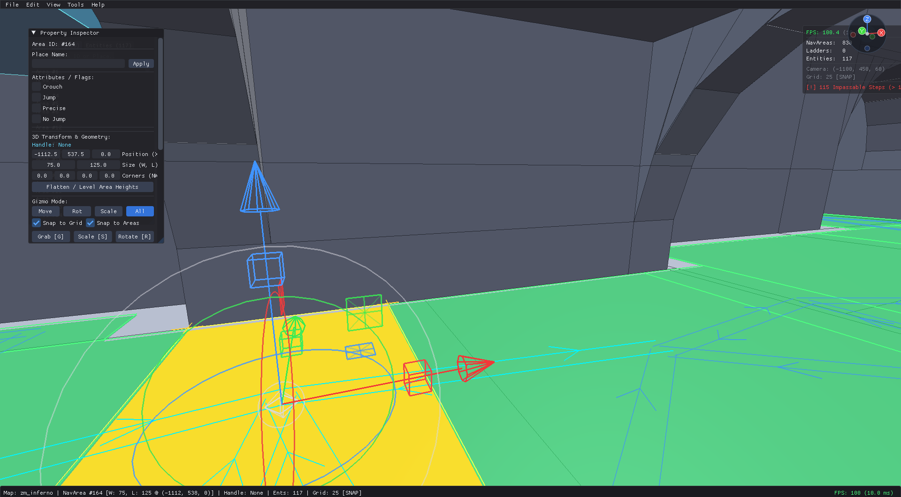
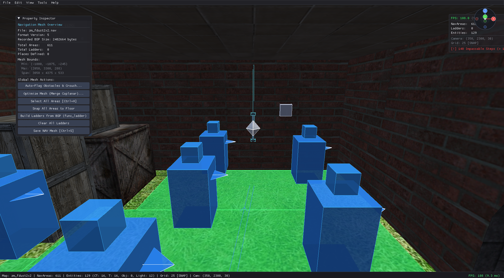

# NavStudio - 3D BSP Visualizer & Navigation Mesh Editor

[](https://github.com/ZeroDiamond7601/NavStudio/actions)
[](https://www.gnu.org/licenses/gpl-3.0)
[%20%7C%20Linux-brightgreen.svg)]()
[](https://github.com/ZeroDiamond7601/NavStudio/releases)

**NavStudio** is a standalone, hardware-accelerated 3D desktop visualizer, navigation mesh editor, and verification suite for **GoldSrc** (`.bsp` v30) maps and **Counter-Strike 1.6 / Condition Zero** (`.nav` v4 & v5) navigation meshes.

It provides real-time OpenGL 3.3 Core rendering with Dear ImGui docking, Valve Hammer Editor-style 3D textured rendering, WAD3 archive texture resolution, interactive mesh modeling tools, collision tracing, and Wavefront OBJ export.

---

## Screenshots

<p align="center">
  
  <br />
  <em>Real-time GoldSrc BSP rendering with WAD3 textures, navigation area selection, 3D multi-axis transform gizmo, directional connection flow, and docked Property Inspector.</em>
</p>

<p align="center">
  
  <br />
  <em>GoldSrc 3D entity archetypes (Terrorist player spawns with head blocks and yaw facing pointers), floor navigation mesh, and Navigation Mesh Overview inspector.</em>
</p>

<p align="center">
  
  <br />
  <em>Studio Clay untextured shading mode (F4) with Z-Up hemisphere lighting and brush edge outlines.</em>
</p>

<p align="center">
  
  <br />
  <em>Counter-Terrorist spawns with 3D player hulls, point light octahedrons, and wooden crate brush entities.</em>
</p>

---

## Key Features

### 3D Hardware-Accelerated Viewport & Shading Modes (`F4`)
* **Hammer 3D Textured View:** Renders full GoldSrc textures mapped onto BSP brush faces with directional sun lighting, ambient hemisphere fill, and specular highlights matching Valve Hammer Editor.
* **WAD3 Archive Loader & Texture Management:** Parses GoldSrc `WAD3` and `WAD2` archives (`cstrike.wad`, `halflife.wad`, etc.), decoding 4-level miptex lumps (`TYP_MIPTEX`) and 256-color RGB palettes into high-resolution 32-bit RGBA OpenGL textures with automatic mipmap generation and repeat wrapping.
* **Embedded & External Texture Resolution:** Automatically resolves external WAD files referenced by `worldspawn` entity `"wad"` key strings, scans map and game mod directories (`cstrike/`, `valve/`), and extracts embedded textures directly from BSP `LUMP_TEXTURES`.
* **Masked Alpha Cutouts:** Transparent alpha-test masking for `{`-prefixed textures (grates, chainlink fences, ladders, vents) discarding masked pixels for clean silhouettes without sorting artifacts.
* **Solid Clay Shading:** Clean neutral studio clay view with GoldSrc Z-Up hemisphere lighting and brush edge outlines.
* **Wireframe & Ghost / X-Ray:** Wireframe edge view and translucent Ghost view to inspect navigation meshes through complex walls and multi-story geometry.

### Interactive Hammer-Style Mesh Editing Tools
* **3D Position Gizmo & Arrows:** Interactive Red (+X East), Green (+Y North), and Blue (+Z Up) axis arrows and center box handle for precise dragging and elevation control.
* **Move / Grab (`G`):** Areas smoothly glide and track the 3D mouse cursor position on the ground plane, with optional `X`, `Y`, `Z` axis constraints.
* **Radial Scale Tool (`S`):** Screen-space radial scaling tool to resize area dimensions smoothly, with optional `X` or `Y` width/length constraints.
* **Individual Edge Manipulation:** Click and drag any of the 4 perimeter edges (North, East, South, West) to resize area bounds, just like Hammer brush faces.
* **Camera-Facing Edge Extrude (`E` / Shift+Drag Edge):** Extrude edges in the camera-facing direction to spawn new adjacent areas automatically stitched with bidirectional connections.
* **Magnetic Edge Snapping on Move:** Seamlessly snaps moved areas flush against neighboring edges and automatically welds lateral connections.
* **Split Knife Tool (`K` / `Shift+X`):** Interactive cutter with cycling angles (`0°`, `45°`, `90°`, `135°`) to slice areas into connected sub-areas while preserving external connections.
* **Bridge Tool (`B`):** 2-click interactive tool to create intermediate connecting areas between any two nav area edges.
* **Draw Area Marquee Tool (`N`):** 2-click rectangular area creation directly on floor and sloped geometry.
* **Flood Fill Area Tool (`F`):** Click any room floor or brush surface to auto-generate connected nav meshes spanning the room.
* **Coplanar Mesh Optimizer:** 1-click simplification that merges contiguous coplanar areas into unified bounding quads.
* **Sloped Corner Elevation Rotation (`R`):** Rotates area 90 degrees clockwise around center while cycling corner elevations to preserve ramp grade and sloped stairs.
* **Duplicate (`Shift+D`):** Clones selected areas with unique IDs and immediately enters Move mode.
* **Delete (`Delete` / `Backspace` / `X`):** Deletes areas or connections with non-destructive Undo/Redo stack support (`Ctrl+Z` / `Ctrl+Y`).
* **Connection Link Management:** Dedicated connection inspection, two-way toggling (`2`), reverse direction (`R`), and midpoint focus (`F`).
* **Place Names Manager & Dropdown:** Assign designated map locations (e.g. `BombsiteA`, `TSpawn`) from an auto-suggested dropdown of existing places.
* **Marquee Box Selection (`Shift+B`):** 2D screen-space rectangle selection for multi-area manipulation.
* **Wavefront OBJ Export:** Export complete navigation meshes with quad geometry and ladder meshes to `.obj` format for Blender, 3ds Max, or game engines.

### GoldSrc Entity System & Hammer-Style 3D Archetypes (`F3`)
* **Player Spawns:** Humanoid 3D hulls (32x32x72) with head indicators and forward-facing yaw orientation arrows:
  * Counter-Terrorist spawns (`info_player_start`) in CT Blue.
  * Terrorist spawns (`info_player_deathmatch`) in T Red.
  * VIP spawns (`info_vip_start`) in Cyan.
* **Objectives & Hostages:**
  * Bomb targets (`info_bomb_target`, `func_bomb_target`) with hazard markers and red objective diamonds.
  * Hostages (`hostage_entity`) with humanoid green hulls and rescue zones (`info_hostage_rescue`, `func_hostage_rescue`).
  * Buy zones (`func_buyzone`) and escape zones (`func_escapezone`).
* **Light Sources:** 3D yellow diamonds/octahedrons for point lights (`light`), spotlight cones and direction vectors for `light_spot`, and ambient sun icons for `light_environment`.
* **Weapons & Armoury:** 3D item crates and diamonds for `armoury_entity` with automatic weapon name resolution (AK-47, M4A1, AWP, Deagle, etc.) and item count.
* **Ambient Audio:** Magenta emitter nodes for `ambient_generic` with sound file and volume inspect.
* **Brush Entities & Triggers:** Bounding volumes with wireframe edges for `func_door`, `func_button`, `func_breakable`, `func_ladder`, and `trigger_*`.
* **Entity Target Connections:** Visualizes cause-and-effect wiring in 3D by rendering cyan-amber linkage lines with directional mid-point arrows between triggers (`target`) and destination entities (`targetname`).

### Bot Waypoint System & Dual-Engine Analyzer (`F6`)
* **Universal Multi-Bot Format Support:**
  * **CS-EBOT (`.ewp`):** Full read/write support for v127 (Haruhiko Okumura LZSS compression), v126, and v125 formats.
  * **SyPB (`.spt` / `.pwf`):** SyPB format graph import/export with mod-specific team and state flags.
  * **YaPB (`.pwf`):** YaPB binary format with LZSS compression and 2-axis camp aim pitch/yaw preservation.
  * **POD-Bot mm (`.pwf` / `.wpt`):** Legacy and modern POD-Bot waypoint structures.
* **Game Mod Specialization:**
  * **Standard Counter-Strike:** Bomb sites, hostage rescue routes, sniper perches, and team-restricted zones.
  * **Zombie Plague / Biohazard:** Human camping perches, dead-end clusters, barricades, and zombie jump paths.
  * **Deathmatch / FFA:** Uniform distribution flow and distributed spawn waypoints.
* **Bidirectional NavMesh <-> Waypoint Conversion:**
  * **NavMesh to Waypoints:** Samples navigation area centers, corners, and centroids; creates graph nodes with height snapping; establishes bi-directional and one-way links based on step/drop limits; and infers team/mod flags.
  * **Waypoints to NavMesh:** Generates contiguous polygonal navigation mesh quads from node clusters and interconnecting pathways.
* **Dual-Engine Automated Waypoint Analyzer:**
  * **CS-EBOT Analysis:** Headroom collision ray-casting against BSP geometry to detect crouching requirements; automated dead-end camp mesh clustering for Zombie Plague.
  * **YaPB Analysis:** 16-angle radial 360-degree sightline ray-casting for sniper/camp perches (calculating exact pitch and yaw aim vectors); step-jump flag derivation from slope differentials; wall-obstructed link pruning.
  * Headless automated analysis via CLI: `nav_cli analyze <file> [map.bsp]`.
* **Interactive 3D Waypoint Visualizer:**
  * Diamond nodes color-coded by bot type and team flags (CT Blue, T Red, Neutral White, Camp Green, Ladder Yellow).
  * Ground contact discs, directional link arrows, parabolic jump arcs, and camp aim vector rays.
  * Direct 3D ray-picking selection, manual node dropping, auto-linking within customizable radius, and inspector flag editing.

---

## Directory Structure

```text
NavStudio/
├── .github/
│   └── workflows/
│       └── build.yml               # CI build & release workflow
├── src/
│   ├── math/                       # Vector3, Ray, Matrix4 math library
│   ├── bsp/                        # GoldSrc BSP v30 lump parsing & collision tracing
│   │   ├── bsp_file.h / .cpp
│   │   ├── bsp_entity.h / .cpp
│   │   └── wad_file.h / .cpp
│   ├── nav/                        # Counter-Strike .nav mesh parser, grid & generator
│   │   ├── nav_area.h / .cpp
│   │   ├── nav_file.h / .cpp
│   │   ├── nav_grid.h / .cpp
│   │   ├── nav_path.h / .cpp
│   │   └── nav_generator.h / .cpp
│   ├── cli/                        # Standalone verification & generator CLI tool
│   │   └── main.cpp
│   ├── waypoint/                   # Multi-bot waypoint engine (CS-EBOT, SyPB, YaPB, POD-Bot)
│   │   ├── compressor.h            # Haruhiko Okumura LZSS compressor & decompressor
│   │   ├── waypoint_types.h        # Node, link, bot format, and game mod definitions
│   │   ├── waypoint_graph.h / .cpp # Node graph, auto-linking, file codecs, and analyzer
│   │   └── waypoint_nav_converter.h / .cpp # Bidirectional NavMesh <-> Waypoint converter
│   └── editor/                     # NavStudio 3D desktop visualizer & editor
│       ├── camera/                 # FPS Flycam, Orbit, and 2D cameras
│       ├── commands/               # Command pattern undo/redo engine
│       ├── glad/                   # Embedded OpenGL 3.3 Core loader
│       ├── render/                 # OpenGL shaders, BSP/NAV/Entity/Skybox renderers
│       ├── scene/                  # Editor scene graph, handles, and ray picker
│       ├── ui/                     # Dear ImGui dockspace, inspector, and hierarchy
│       └── main.cpp                # GLFW window and application loop
├── third_party/                    # GLFW & Dear ImGui
├── CMakeLists.txt                  # Standalone CMake build file
├── LICENSE
└── README.md
```

---

## Keyboard Shortcuts

| Shortcut | Action |
| :--- | :--- |
| **Right-Click Drag** | FPS Freelook / Flycam rotation |
| **W, A, S, D** | Move camera (Flycam) |
| **Shift** | Fast camera move speed multiplier |
| **F4** | Cycle Shading Mode (Textured, Clay, Wireframe, Translucent) |
| **F3** | Toggle Entity Archetypes display |
| **F6** | Toggle Bot Waypoint rendering & overlays |
| **G** | Move / Grab selected areas (tracks ground plane) |
| **S** | Radial Scale tool (when area selected) |
| **E** | Extrude camera-facing edge |
| **K / Shift+X** | Knife cut tool (press **R** to cycle angles: 0°, 45°, 90°, 135°) |
| **B** | Bridge tool (2-click edge bridge) |
| **N** | Draw area marquee tool (2-click floor rect) |
| **F** | Flood fill area tool (when nothing selected) / Focus camera (when area/connection selected) |
| **R** | Rotate selected area 90° / Reverse selected connection direction |
| **2** | Toggle selected connection bidirectional / Set Gizmo to Rotate |
| **Shift+D** | Duplicate selected area |
| **Delete / Backspace / X** | Delete selected connection or area |
| **Ctrl+Z / Ctrl+Y** | Undo / Redo |
| **Ctrl+A** | Select All areas |
| **Shift+B** | Toggle Marquee Box Select tool |
| **[ / ]** | Decrease / Increase reference grid size |
| **Shift+W** | Toggle grid snapping |
| **Ctrl+,** | Preferences window |
| **Esc** | Cancel current tool mode / Deselect connection / Clear area selection |

---

## Building from Source

### Requirements
* CMake 3.15+
* C++17 compatible compiler (MSVC 2019/2022 on Windows, GCC/Clang on Linux)

### Windows (Visual Studio)
```powershell
cmake -B build -A Win32 -DBUILD_EDITOR=ON -DBUILD_CLI=ON
cmake --build build --config Release
```
Output binaries:
* `build/Release/nav_editor.exe`
* `build/Release/nav_cli.exe`

### Linux
```bash
sudo apt-get install -y cmake make g++ libgl1-mesa-dev libx11-dev libxrandr-dev libxinerama-dev libxcursor-dev libxi-dev
cmake -B build -DCMAKE_BUILD_TYPE=Release -DBUILD_CLI=ON
cmake --build build --config Release -j$(nproc)
```
Output binary:
* `build/nav_cli`

---

## License
NavStudio is licensed under the [GNU General Public License v3.0](LICENSE).
